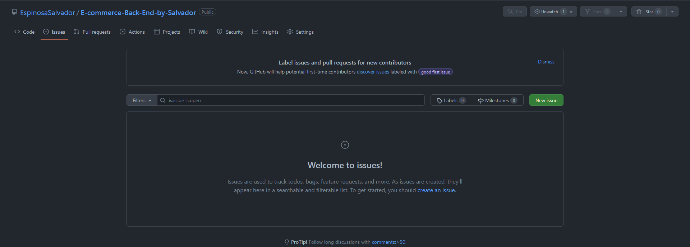

# E-commerce Back End by Salvador

## Table of Content

* [Introduction](#introduction)
* [Features](#features)
* [Requirements](#requirements)
* [Installation](#installation)
* [Video](#video)
* [Configuration](#configuration)
* [What you should be able to see](#what-you-should-be-able-to-see)
* [Troubleshooting](#troubleshooting)
* [Next Phase Development](#next-phase-development)
* [FAQ (Frecuently Asked Questions)](#faq-frecuentrly-asked-questions)
* [Team](#team)

## Introduction

Welcome to the E-commerce back end application. this application allows users to write, save, update, delete and create new information to the database through this Javascript code

[Link to my Github Repository](https://github.com/EspinosaSalvador/E-commerce-Back-End-by-Salvador)

## Features

This app is suppose to be used at the same time with Insomnia so we can add, update, eliminate the db. this will be more intuitive for the user.

* View all Category, or only see one specific one, update, or delete.
* View all products, or only see a specific one, update, or delete.
* View all tags or only see a specific one, update or delete.

## Requirements

* Node.js installed on the system
* dotenv to version 8.2.0
* sequelize to version 5.21.7
* mysql2 package version 3.2.1 or higher installed

## Installation

To install this project please proceed to my [GitHub Repository](https://github.com/EspinosaSalvador/E-commerce-Back-End-by-Salvador)

you should be able to see this,


Click on code as shown in the image


Copy the SSH key or the HTTPS key and open.

* Terminal
* Git bash
* CMD

either one of this will work. please proceed to the terminal an put in your Terminal,

```
git clone git@github.com:EspinosaSalvador/E-commerce-Back-End-by-Salvador.git
```

and now you have a copy of the code.

you can work/play/use the app

## Video

if you want to watch my walkthorough please click on the video. we are doing the same steps that were previously stated.

[](https://drive.google.com/file/d/1Ca7Zyrq-ttSEVDJrPyznqdMQzxGQXxfp/view)

## Configuration

If you want to do any configurations on this project please open a new branch you can do this by putting the following code in your terminal,

```
git checkout -b ＜new-branch＞
```

switch branches putting the following code on your terminal.

```
git checkout ＜branchname＞
```

If you want to show us your code and merge please open a pull request on

[Github](https://github.com/EspinosaSalvador/E-commerce-Back-End-by-Salvador/pulls).


## What you should be able to see

To start this app please use npm i to install the dependencies that we have on the package.json after that please enter to your msql password and user so you can download the database.

```
mysql -u root -p
```

 that I have to do that please insert this into your terminal

```
SOURCE db/schema.sql
```

after the db is installed please proceed to exit mysql

just type in the terminal the following.

```
exit
```

after you have done this please also use the following command to your terminal

```
node seeds/index.js
```
after all of these is done please proceed to use the script that I have on package.json

which is 

```
npm start
```


lets open our insomnia app in the computer and lets start playing with the js.

for this expample we will be going with all the categories that we can. but the other one will be used and or explain more indepth in the video.


the image above show us what we need to input inside the url to see our work in this example we are using the get to see all our categories from the db/e-commerce

lets proceed by seeing the url that we need to input to see only one category


as you can see above is pretty similar the only difference is that it has a number with the id at the end.


when we click on view all employees you should be able to see this.

you should see the following rows in the table:

in this example we only want to update id 3 and we want to change the name of the category_name to :"eat_my_shorts"

to see if this works please go back to your get section and see if this is updated.


to delete the category we only need the id as in previous example as soon as you send this it will be deleted from the db.

and repeat the same process with tag, product and category.

## Troubleshooting

The Employee-Tracker is in version 1.0, please let me know if there are anybug in the webpage by issuing it in [Github](https://github.com/EspinosaSalvador/E-commerce-Back-End-by-Salvador/issues)



## Next Phase Development

This are will be updated depending on the feedback from the users.

## FAQ (Frecuentrly Asked Questions)

We will update this part when we have some frequently asked question.

## Team

* Salvador Espinosa Valdez
